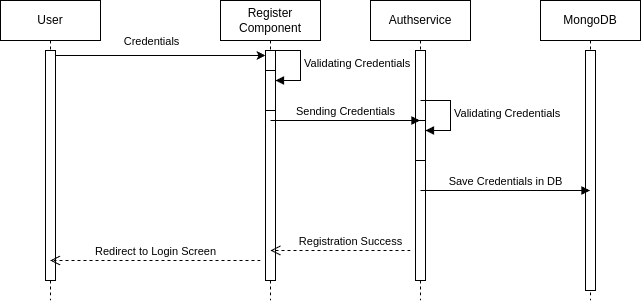
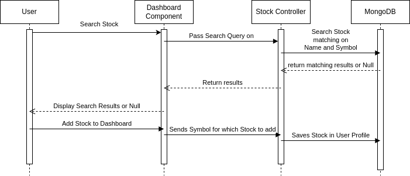

== Laufzeitschicht

=== Registrierung
Die Registrierung eines neuen Benutzers erfolgt über die Benutzeroberfläche des Frontends. Die Benutzerdaten werden an den Backend-Server gesendet, der die Anfrage validiert und die Daten in der MongoDB-Datenbank speichert. Nach erfolgreicher Registrierung wird der Benutzer auf den Login Screen weitergeleitet um sich anzumelden.

=== Anmeldung
Die Anmeldung eines Benutzers erfolgt über die Benutzeroberfläche des Frontends. Die Benutzerdaten werden an den Backend-Server gesendet, der die Anfrage validiert und die Daten mit der Datenbank abgleicht. Bei erfolgreicher Anmeldung wird ein JWT-Token generiert und an den Client zurückgesendet. Dieser Token wird für alle weiteren Anfragen benötigt um den Benutzer zu authentifizieren.

image::../images/login.drawio.png[align="center",width=90%,title="Anmeldung"]

=== Dashboard
Das Dashboard ist die zentrale Ansicht der Anwendung, auf der der Benutzer seine personalisierten Aktieninformationen und -visualisierungen sieht. Die Daten werden über die REST-API vom Backend abgerufen und im Frontend dynamisch dargestellt. Der Benutzer kann Aktien hinzufügen, entfernen und konfigurieren, um sein Dashboard individuell anzupassen.

HINWEIS: Falls die Aktie nicht gefunden wird wird nichts zurückgegeben.

==== Live-Aktualisierung
Die Aktienkurse werden in Echtzeit aktualisiert, um dem Benutzer stets die aktuellen Informationen zu liefern. Hierfür wird eine WebSocket-Verbindung zwischen Frontend und Backend aufgebaut, über die die Kursdaten in regelmäßigen Abständen übertragen werden. Die Daten werden im Frontend dynamisch aktualisiert, ohne dass der Benutzer die Seite neu laden muss.

image::../images/websocket.drawio.png[align="center",width=90%,title="Live-Aktualisierung"]